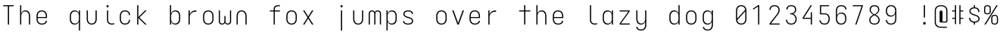
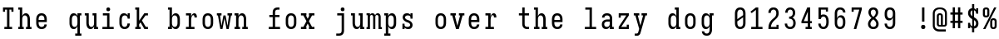
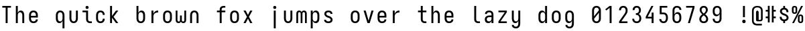
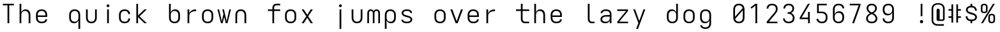

# Trulle Mono Font Variants

This repository hosts the for the typeface Trulle Mono, a highly customizable monospaced font. This document describes four distinct variants of Trulle Mono: Trulle Mono Snake, Trulle Mono Slab, Trulle Mono Neue, and the newly added Trulle Mono Streamlined, highlighting their unique characteristics.[cite: 6]

## Trulle Mono Snake

*Characteristics*:
Imagine a font that's a bit more artistic, with subtle curves and a flowing feel. It's not as rigid as some monospaced fonts.[cite: 6]

*   **Who should use it:** If you fancy a softer, less aggressive look, or if you're using the font for creative writing, presentations, or anything where a touch of elegance is desired.[cite: 6]
*   **Font Size/Resolution:** It should look good at most sizes, but its subtle curves might be less noticeable or even slightly blurry on very low-resolution screens or at extremely small font sizes. On high-resolution displays, its unique character will shine.[cite: 6]
*   **For Coding?** Probably not the first choice for serious coding. The subtle curves might make it harder to distinguish characters quickly, especially when scanning lines of code.[cite: 6]

## Trulle Mono Slab

*Characteristics*:
This one is bold and sturdy. Think of it as having little "feet" (serifs) on each letter, making them stand out more. It has a strong, almost typewriter-like presence.[cite: 6]

*   **Who should use it:** Great for headings, titles, or any situation where you want the text to have a significant visual impact. It's very readable even at smaller sizes because of its clear, defined shapes.[cite: 6]
*   **Font Size/Resolution:** Excellent across all resolutions and sizes. The strong serifs help maintain character distinction even on lower-resolution screens or when the font is very small.[cite: 6]
*   **For Coding?** A solid choice for coding. The distinct serifs help differentiate similar-looking characters (like 'l', '1', 'I' or '0', 'O') which is crucial for code readability.[cite: 6]

## Trulle Mono Neue

*Characteristics*:
This is the clean, modern, and straightforward option. It has no "feet" (sans-serif), giving it a minimalist and uncluttered appearance. It's designed for clarity.[cite: 6]

*   **Who should use it:** If you prefer a sleek, contemporary look. It's particularly well-suited for user interfaces, digital documents, and especially for coding.[cite: 6]
*   **Font Size/Resolution:** Performs very well at all sizes and resolutions. Its clean lines prevent blurriness on lower-resolution screens and offer crispness on high-resolution displays.[cite: 6]
*   **For Coding?** Highly recommended for coding. The lack of serifs reduces visual noise, making it easy to read and scan code quickly. It's designed for long hours of screen reading.[cite: 6]

## Trulle Mono Streamlined

*Characteristics*:
This variant is the epitome of typographical efficiency. It features an extremely clean, "pipe-like" design where unnecessary hooks and serifs have been completely removed (like the perfectly straight 'i' and 'j'), paired with highly organic, rounded vowels ('e', 'a'). It boasts a slightly wider character shape and generous sidebearings.

*   **Who should use it:** Ideal for terminal power users, Lisp (Clojure) developers, and LaTeX writers. The deep contour brackets and high-placed symbols (like tilde and caret) make complex syntax highly readable.
*   **Font Size/Resolution:** Exceptional at smaller sizes. Because of the generous tracking and balanced character width, you can comfortably drop the font size (e.g., to 12.5px) without losing any legibility or feeling cramped.
*   **For Coding?** Absolute top tier. The minimal visual clutter allows for long, focused coding sessions. The italic variant is also heavily customized with cursive forms to provide a beautiful, distinct contrast for code comments and keywords.

## Comparison of Trulle Mono Variants

| Feature        | Trulle Mono Snake            | Trulle Mono Slab                  | Trulle Mono Neue                               | Trulle Mono Streamlined                        |
| :------------- | :--------------------------- | :-------------------------------- | :--------------------------------------------- | :--------------------------------------------- |
| **Serifs**     | Subtle curves/fluid[cite: 6]| Prominent slab serifs[cite: 6]   | Sans-serif (no serifs)[cite: 6]               | Utterly serifless and hookless, rounded vowels |
| **Visual Feel**| Artistic, flowing[cite: 6]  | Bold, sturdy, typewriter-like[cite: 6]| Clean, modern, minimalist[cite: 6]            | Airy, highly legible, unobtrusive              |
| **Coding Suitability** | Less ideal (subtle curves)[cite: 6]| Good (distinct characters)[cite: 6]| Highly recommended (clean, clear)[cite: 6]    | Exceptional (optimized spacing, coding ligatures)|

## Font Samples

### Trulle Mono Neue
[cite: 6]

### Trulle Mono Slab
[cite: 6]

### Trulle Mono Snake
[cite: 6]

### Trulle Mono Streamlined

