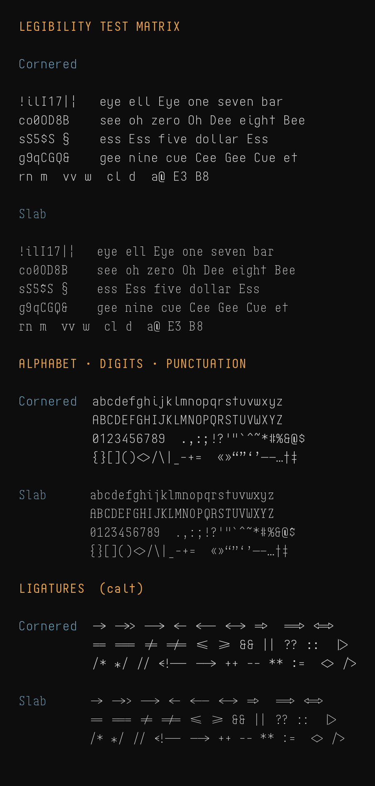
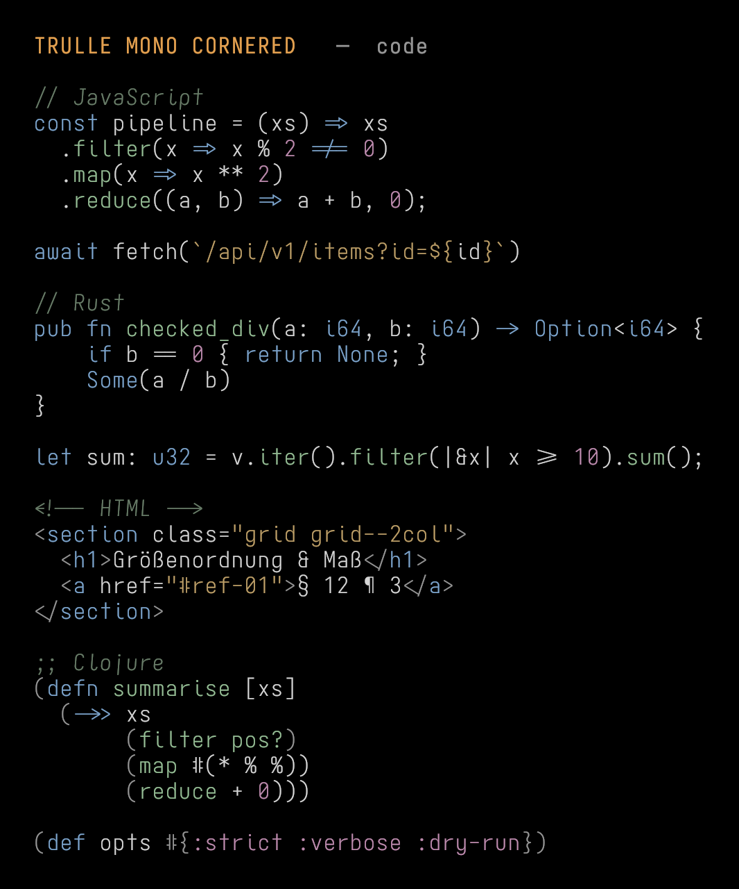
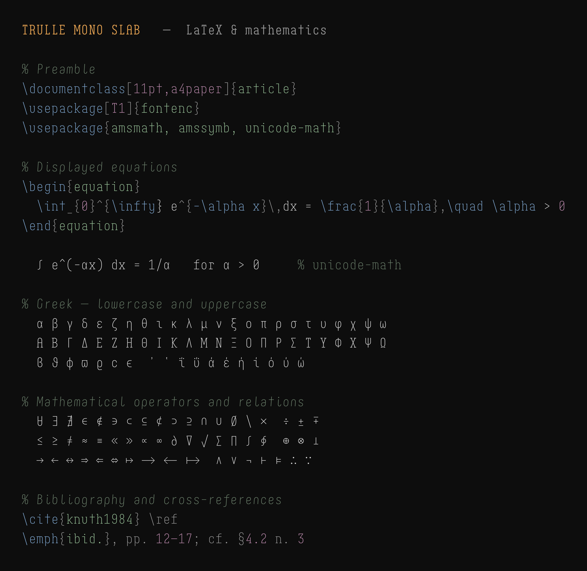
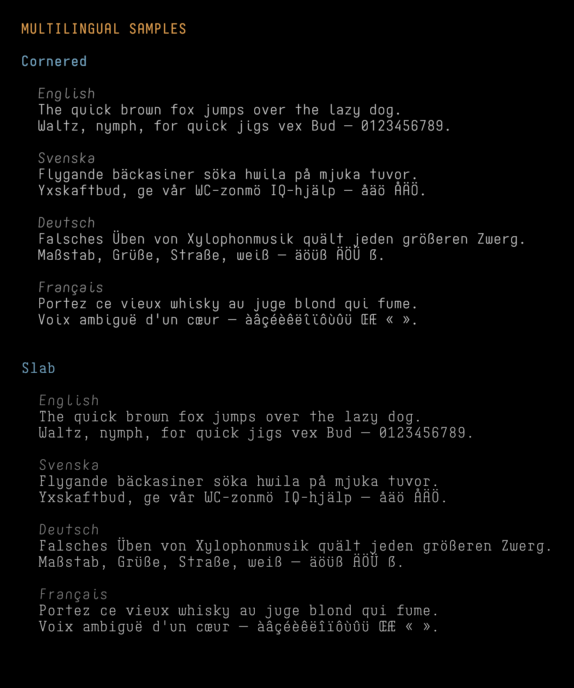
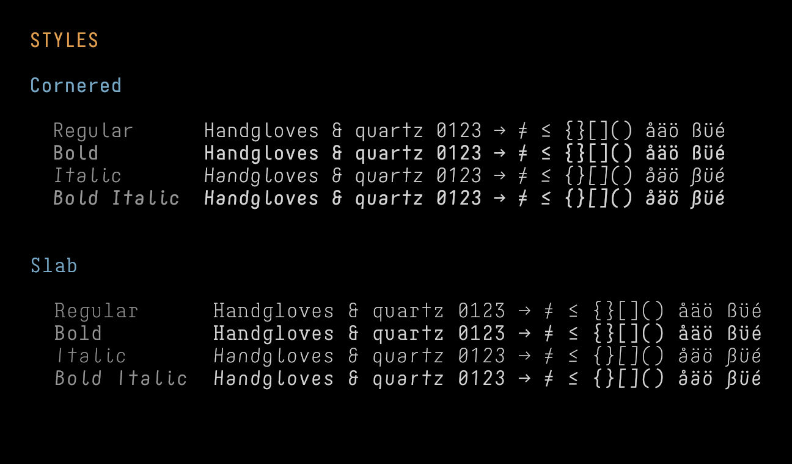

# Trulle Mono

**Trulle Mono**: For those who like to keep things _tidy_.

Two monospace typefaces for terminals, editors and typesetting, built from
custom [Iosevka](https://github.com/be5invis/Iosevka) build plans.

They are siblings rather than weights of the same face: **Cornered** is a
sans-serif tuned for dense code, **Slab** is a serifed face tuned for prose
you actually read. Both ship in Regular, Bold, Italic and Bold Italic, use
`term` spacing, and carry Iosevka's `default-calt` ligature set.

---

## Two families, two jobs

|                   | **Cornered**                                   | **Slab**                                        |
| ----------------- | ---------------------------------------------- | ----------------------------------------------- |
| Character         | Sans-serif                                     | Serifed uprights, serifless italics             |
| Best for          | Code, terminals, dense listings                | Documentation, prose, LaTeX                     |
| Serif strategy    | Serifs only where they disambiguate (`I`, `J`) | Serifs throughout, including `B C D S`          |
| Lowercase `i` `l` | Semi-tailed                                    | Z-shaped                                        |
| Lowercase `a`     | Double-storey, flat bottom                     | Double-storey, inward-hooked                    |
| Weight (stem)     | 250 / 400                                      | 200 / 300                                       |
| Width             | 590                                            | 570                                             |
| Letter spacing    | Tight                                          | Airy                                            |
| Italic angle      | 4.2°                                           | 3.9°                                            |

Both families share the same disambiguation priorities — a slashed zero, an
unambiguous `1`, and `i` / `l` / `j` that never collapse into one another —
but each solves them with letterforms that suit its own character.

The serifless italic in **Slab** is deliberate: against serifed uprights it
gives comments and string literals a contrast you can see at a glance,
without shouting.

---

## Samples

All samples below are rendered from the shipped TTFs with HarfBuzz, so
ligatures and spacing appear exactly as they do on screen.

### Legibility

The pairs that matter: `il1I`, `0OD8B`, `rn` vs `m`, `cl` vs `d`.



### Code — Cornered

JavaScript, Rust, HTML and Clojure, with contextual ligatures active.



### LaTeX and mathematics — Slab

Greek, mathematical operators and typesetting markup.



### Multilingual

English, Swedish, German and French — diacritics, ligatures and quotation
marks.



### Styles



---

## Installing

Download the TTFs from [`fonts/`](fonts/) and install them.

**macOS** — double-click each file and choose *Install Font*, or:

```sh
cp fonts/*.ttf ~/Library/Fonts/
```

**Linux**

```sh
mkdir -p ~/.local/share/fonts
cp fonts/*.ttf ~/.local/share/fonts/
fc-cache -f
```

**Windows** — select the files, right-click, *Install for all users*.

### Using them

The family names are `Trulle Mono Cornered` and `Trulle Mono Slab`.

WezTerm:

```lua
config.font = wezterm.font("Trulle Mono Cornered")
config.font_size = 14.5
```

Alacritty:

```toml
[font.normal]
family = "Trulle Mono Cornered"
```

VS Code:

```json
"editor.fontFamily": "Trulle Mono Cornered",
"editor.fontLigatures": true
```

CSS:

```css
font-family: "Trulle Mono Slab", ui-monospace, monospace;
```

---

## Credits and licence

Trulle Mono is a custom build of **Iosevka** by Renzhi Li (Belleve Invis).
Iosevka is licensed under the [SIL Open Font License 1.1][ofl], and this
derivative is distributed under the same licence. See [`LICENSE`](LICENSE)
for the full text and the original copyright notice.

[ofl]: https://scripts.sil.org/OFL
